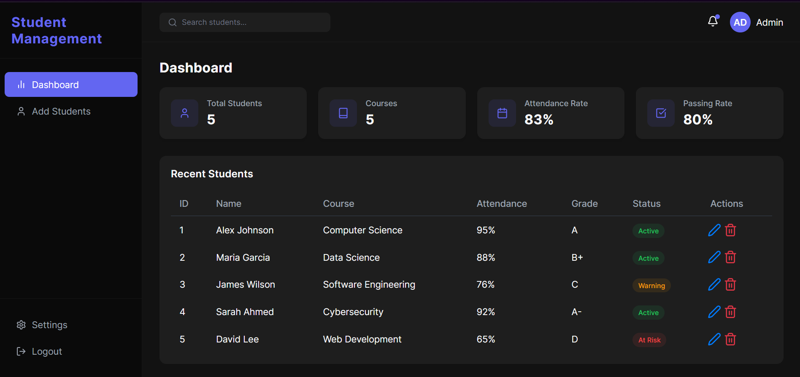
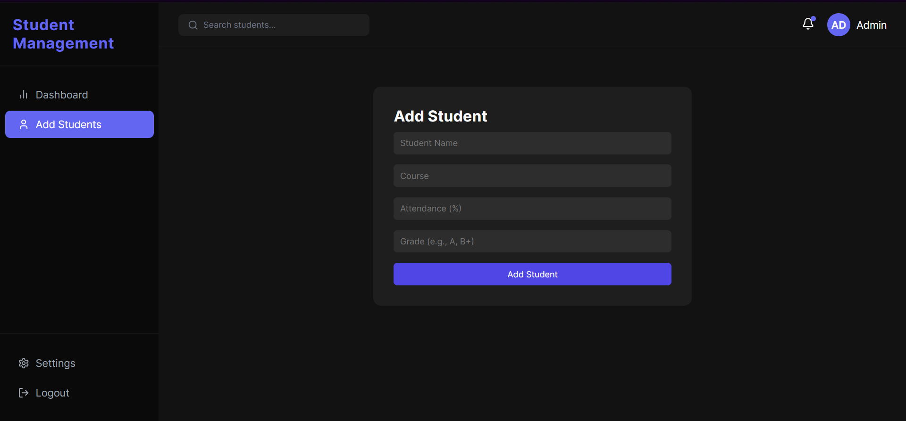
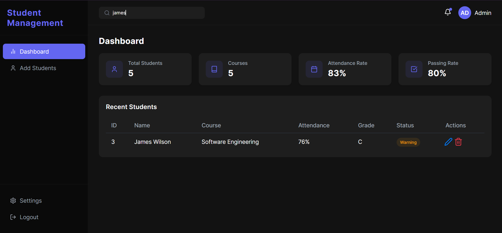
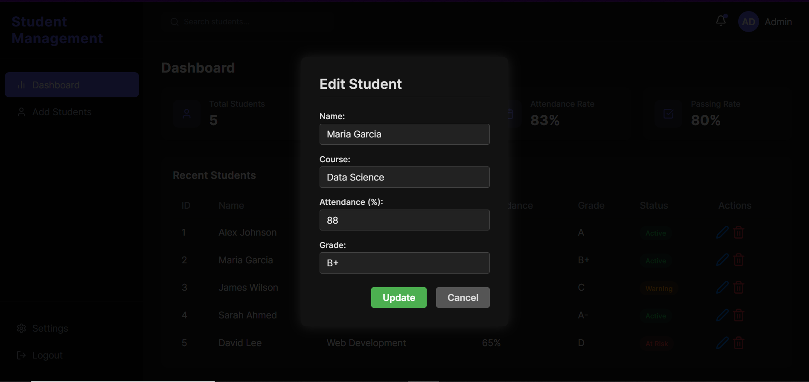
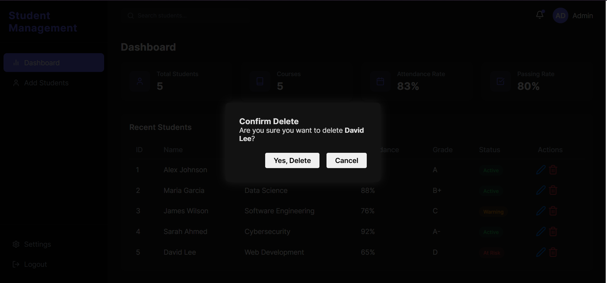

# 🎓 Student Management System

A modern **Student Management Dashboard** built with **React** that allows administrators to manage students, view statistics, and monitor academic performance through a clean and intuitive interface.

The project focuses on **UI/UX clarity**, **component-based architecture**, and **dashboard-style data presentation**.

---

## Features

### Implemented & Working

* Dashboard overview (students, courses, attendance & passing rate)
* Add new students
* Edit existing student records
* Search students
* Student listing with:
  * Attendance
  * Grades
  * Status (Active / Warning / At Risk)
* Dark-themed modern UI
* Modular React components

### Not Implemented Yet (Planned)

The following features are **UI-only* and **do not work yet**:

* Settings
* Notifications
* Admin Profile
* Logout functionality


---

## Screens Preview

### Dashboard



### Add Student Screen



### Search Students



### Edit Student Details



### Delete Student 



---

## Tech Stack

* **React (Create React App)**
* **JavaScript (ES6+)**
* **CSS / Custom Styling**
* **React Hooks**
* **Component-based architecture**

---

## How to Run the Project

### 1. Install dependencies

```bash
npm install
```

### 2. Start development server

```bash
npm start
```

### 3. Open in browser

```
http://localhost:3000
```

---

## 📌 Future Enhancements

Planned improvements for upcoming versions:

* Authentication & role-based access
* Real-time notifications
* Fully functional settings page
* Backend integration (Node / Firebase / Laravel API)
* Persistent data storage (DB)
* Responsive mobile support
* Charts & analytics
* Deployment (Vercel / Netlify)

---
